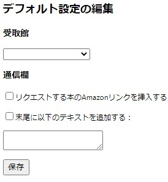

# 概要
「その本、徳島大学図書館で買いますよ」は、Amazonで今見ている本を徳島大学図書館へ購入リクエストを送るGoogle Chromeの拡張機能です。

Amazonに記載している本の情報が、購入リクエストページにある以下すべてのフォームへ自動入力されます。
- 書名
- 著者名
- 出版社
- 出版日付
- ISBN
- 受取館
- 通信欄

# 使い方
Chrome拡張機能ページでインストールすると、Amazonで本の商品ページの価格欄の下に「🏫徳島大学図書館で購入する」リンクが表示されるようになります。
そのリンクをクリックすると、Amazonで見ていた本の情報が自動入力された本のリクエストページに移動します。

# 設定
受取館(常三島 or 蔵本)、通信欄の初期設定を変更できます。

方法：
Chrome右上「...」→「その他のツール」→「拡張機能」→「その本、徳島大学図書館で買いますよ」の「詳細」→「拡張機能のオプション」で編集画面が開きます。

設定編集後、「保存」ボタンで保存されます。

# その他
ISBNは、ISBN-13のハイフン抜きで入力されます。

この拡張機能の誤動作などから生じた故障又は損害に関して、一切の責任を負いかねますのであらかじめご了承ください。