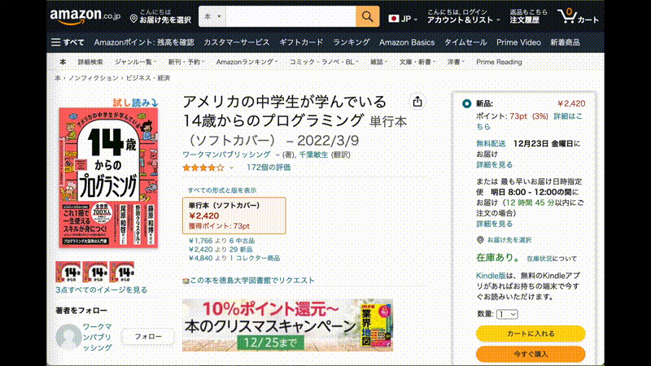
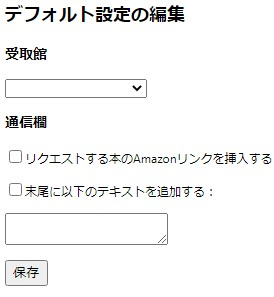
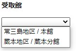

# 概要
「Amazonの本、徳島大学図書館で買いますよ」は、Amazonで今見ている本を徳島大学図書館へ購入リクエストを送るGoogle Chromeの拡張機能です。

Amazonに記載している本の情報が、購入リクエストページにある以下すべてのフォームへ自動入力されます。
- 書名
- 著者名
- 出版社
- 出版日付
- ISBN
- 受取館
- 通信欄

# 使い方
1. [Chrome拡張機能ページ](https://chrome.google.com/webstore/detail/amazon%E3%81%AE%E6%9C%AC%E3%80%81%E5%BE%B3%E5%B3%B6%E5%A4%A7%E5%AD%A6%E5%9B%B3%E6%9B%B8%E9%A4%A8%E3%81%A7%E8%B2%B7%E3%81%84%E3%81%BE%E3%81%99%E3%82%88/idbofpbgnkbiidapkbpppeinagoglaaf)でインストール
2. Amazon内の本の商品ページの価格欄の下の「🏫徳島大学図書館で購入する」リンクをクリック。
3. 本の情報が自動入力された購入リクエストフォームが開きます。

# 設定
Chrome右上「...」→「その他のツール」→「拡張機能」→「Amazonの本、徳島大学図書館で買いますよ」の「詳細」→「拡張機能のオプション」で編集画面が開きます。

受取館(常三島 or 蔵本)と通信欄の初期状態を変更できます。

設定編集後、「保存」ボタンで保存されます。

# その他
ISBNは、ISBN-13のハイフン抜きで入力されます。

この拡張機能の誤動作などから生じた故障又は損害に関して、一切の責任を負いかねますのであらかじめご了承ください。
